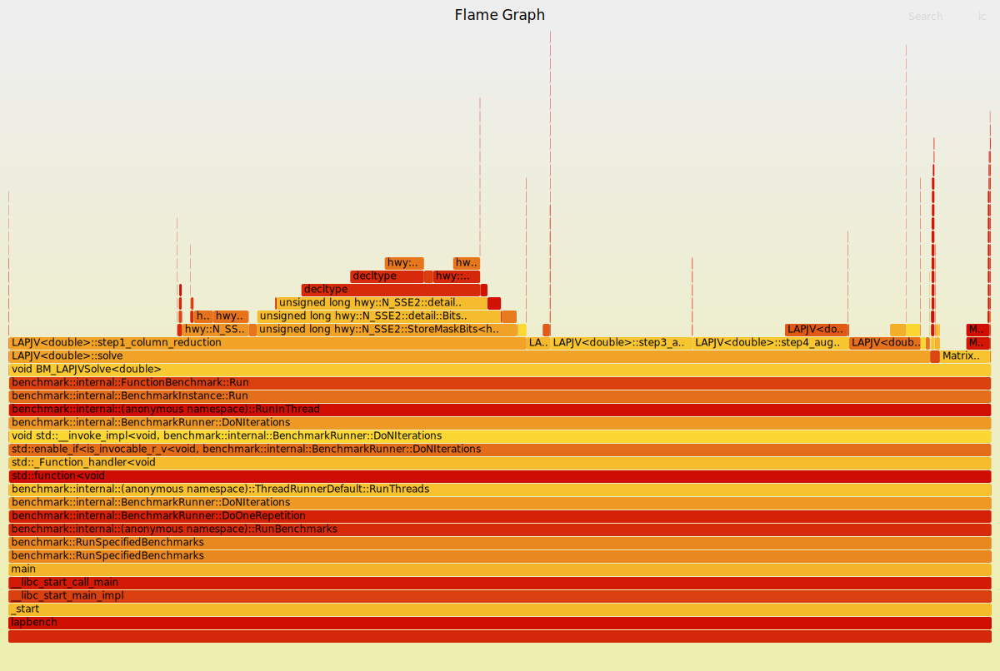

# fast-lapjv 

The objective of this project is to optimize the famous LAPJV algorithm in C++. 
The current C/C++ implementation is based off of https://github.com/yongyanghz/LAPJV-algorithm-c, and inspired by:
- https://github.com/google/highway
- https://github.com/src-d/lapjv
- https://agner.org/optimize/optimizing_cpp.pdf
- https://github.com/saebyn/munkres-cpp

Optimization strategies/areas of focus adopted in this project include:
- Caching
- SIMD
- Pipelining 
- Compilation 
- Floating point calculations 

More details on methodology can be found later.

Finally, this project + compilation tweaks results in an algorithm that is over twice as fast as the original!
[Baseline](benchmarks/baseline.pdf) vs [Final](benchmarks/final.pdf) benchmarks have been included.


Gemini was used in the creation of this project.

## Requirements
The project uses Bazel as its main build system. To use this library in your own Bazel project, add the following to your `MODULE.bazel` file:

```python
git_repository = use_repo_rule("@bazel_tools//tools/build_defs/repo:git.bzl", "git_repository")
git_repository(
    name = "lapjv",
    remote = "https://github.com/yourusername/LAPJV-Optimizations.git",
    commit = "master",
)
```

## Usage
The library provides a simple template-based API for solving the Linear Assignment Problem.

```cpp
#include "src/lap.h"
#include "src/matrix.h"

int main() {
    // Create a 5x5 cost matrix
    Matrix<double> costs(5, 5);
    // ... fill costs ...

    LAPJV<double> solver;
    solver.solve(costs);

    // After solve(), costs(i, j) will be:
    //  0.0  if row i is assigned to column j
    // -1.0  otherwise
    return 0;
}
```

### Optimization Flags
By default, the library compiles with maximum optimizations enabled. This includes:
- `-O3` and `-march=native`
- `-ffast-math` and `-fopenmp-simd`
- Link-Time Optimization (`-flto`)
- SIMD acceleration via [Google Highway](https://github.com/google/highway)

To disable these optimizations and enable debugging features, explicitly use the debug compilation mode:
```bash
bazel build -c dbg //your_target
```

## Benchmarking
To run benchmarks and compare results:

1. **Build and Run Benchmark:**
   ```bash
   bazel build --config=max //test:lapbench
   ./bazel-bin/test/lapbench --benchmark_out=results.json --benchmark_out_format=json
   ```

2. **Compare with Previous Results:**
   ```bash
   bazel run //test:compare_benchmarks -- $(pwd)/results.json
   ```

3. **Generate Visual Reports (PDF):**
   ```bash
   bazel run //test:vis_benchmark -- $(pwd)/results.json
   ```
   The reports will be saved in the `reports/` directory.

## Testing
Unit tests are written using GoogleTest and cover various edge cases including non-square matrices and large dimensions.

```bash
bazel test //test:laptest
```

## Tracing & Profiling


Trace details and symbols are only generated in debug mode. To generate a flamegraph:
1. `bazel build --config=dbg //test:lapbench`
2. `perf record -g -o flamegraph/perf.data ./bazel-bin/test/lapbench --benchmark_filter="BM_LAPJVSolve<double>/512"`
3. `perf script -i flamegraph/perf.data | stackcollapse-perf.pl | flamegraph.pl > flamegraph/flamegraph.svg`

Ensure you have the [flamegraph scripts](https://github.com/brendangregg/flamegraph) installed and in your `PATH`.

## Methodology/Discussion
The goal of this implementation is to modify the work of https://github.com/yongyanghz/LAPJV-algorithm-c and integrate a more friendly API interface as in the case of https://github.com/saebyn/munkres-cpp for matrix use. Thus, in this extended secttion, the strategies and trade-offs for certain design elements will be illustrated in order of prioritization. This order is mainly grounded via empirical results with benchmarking in correspondance to Amdahl's Law regarding the efficacy of optimizations. 

### 1) Compilation
The compiler always knows best, and generates far more portable optimizations than a singular developer can most times write across multiple architectures. Knowledge of the compiler flags, and general C++ language was the first step in performance gains (e.g. templating, aggressive inlining, optimal copy ellision). The more compute can be moved outside to before runtime the better! This step along saw a significant bump in performance. 

### 2) Caching
Matrix operations as in the case of many LAP problems, often result in predicable patterns of traversal, and thus, for larger sized data, cache misses become more significant. Given the many traversals in the various steps of the algorithm, another somewhat easy performance bump can be attained by maximizing the spatial locality of accesses (i.e. reducing strided accesses) by tweaking the traversal direction of loops.

### 3) Pipelining
As general CPU architecture dicates pipelined implementations, it is common knowledge that data and control hazards can contribute the most slowdowns in computation. Specifically, this is most significant with operations involving branching/main memory. For example, function returns generally incur multiple cycles of stalling, and similarly this occurs when in cases of failed branch prediction. In C++, we can mitigate some of this via explicit notifications to the compiler to either: inline functions & eliminate function returns, and suggest likely branching behaviour using C++'s built in flags.  

### 4) Parallelization
Adding to the case of matrix operations being able to leverage SIMD (Single Instruction Multiple Data) architectures, we can also lend the compiler a hand in optimizing for this in steps where it is clear that parallelism is possible. Google Highway was used for this case to allow for a portable implementation of parallelism without delving into platform specific libraries such as AVX2 intrinsics. 


